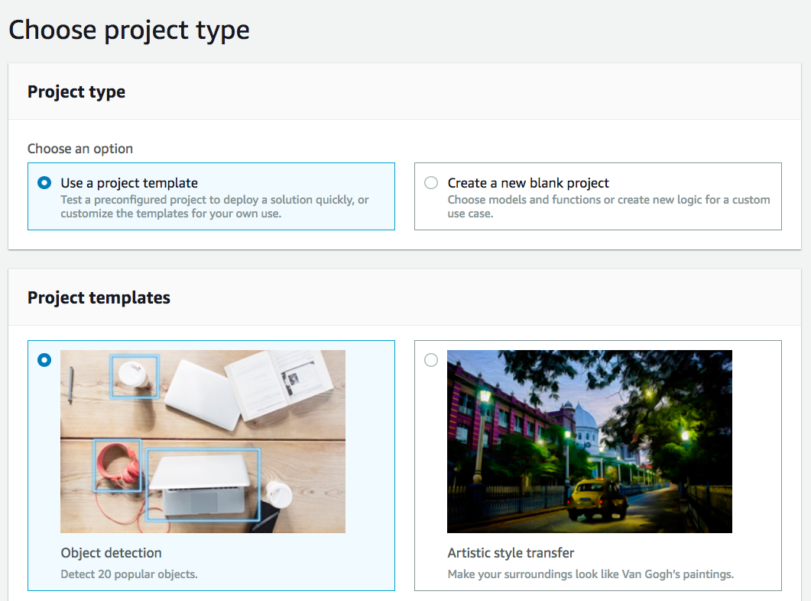

# Object Detection Using Deep Lens

## Create Your Project

1. Using your browser, open the AWS DeepLens console at https://console.aws.amazon.com/deeplens/.
2. Choose Projects, then choose Create new project.
3. On the Choose project type screen
- Choose Use a project template, then choose Object detection.



- Scroll to the bottom of the screen, then choose Next.
4. On the Specify project details screen
   - In the Project information section:
      - Either accept the default name for the project, or type a name you prefer.
      - Either accept the default description for the project, or type a description you prefer.
   - In the Project content section:
      - Model—make sure the model is deeplens-object-detection. If it isn't, remove the current model then choose Add model. From the list of models, choose deeplens-object-detection.
      - Function—make sure the function is deeplens-object-detection. If it isn't, remove the current function then choose Add function. From the list of functions, choose deeplens-object-detection.

      

  - Choose Create.

This returns you to the Projects screen where the project you just created is listed with your other projects.

## Deploy your project

Next you will deploy the Object Detection project you just created.

1. From Deeplens console, On the Projects screen, choose the radio button to the left of your project name, then choose Deploy to device.


2. On the Target device screen, from the list of AWS DeepLens devices, choose the radio button to the left of the device that you want to deploy this project to. An AWS DeepLens device can have only one project deployed to it at a time.


3. Choose Review.

   This will take you to the Review and deploy screen.

   If a project is already deployed to the device, you will see an error message
   "There is an existing project on this device. Do you want to replace it?
   If you Deploy, AWS DeepLens will remove the current project before deploying the new project."

4. On the Review and deploy screen, review your project and choose Deploy to deploy the project.

   This will take you to to device screen, which shows the progress of your project deployment.

## View your project output

1. You need mplayer to view the project output from Deeplens device. For Windows, follow the installation instructions at this link: http://www.mplayerhq.hu/design7/dload.html
For Mac, install mplayer by using command below in the terminal window:

```
brew install mplayer
```

2. Wait until the project is deployed and you see the message Deployment of project Face-detection, version 0 succeeded. After project is successfully deployed, use the command below from terminal window to view project output stream:

```
ssh aws_cam@<IP Address of your deeplens device> cat /tmp/results.mjpeg | mplayer -demuxer lavf -lavfdopts format=mjpeg:probesize=32 -
```
Example:
```
ssh aws_cam@192.168.86.120 cat /tmp/results.mjpeg | mplayer -demuxer lavf -lavfdopts format=mjpeg:probesize=32 -
```

## Completion
You have create and deployed object detection project to your Deeplens device. In the next module, [Hot Dog Not Hot Dog](../2-HotDogNotHotDog), you will learn how to edit a pre-trained object recognition model in SageMaker to perform a binary classification and deploy newly trained model to the device.
