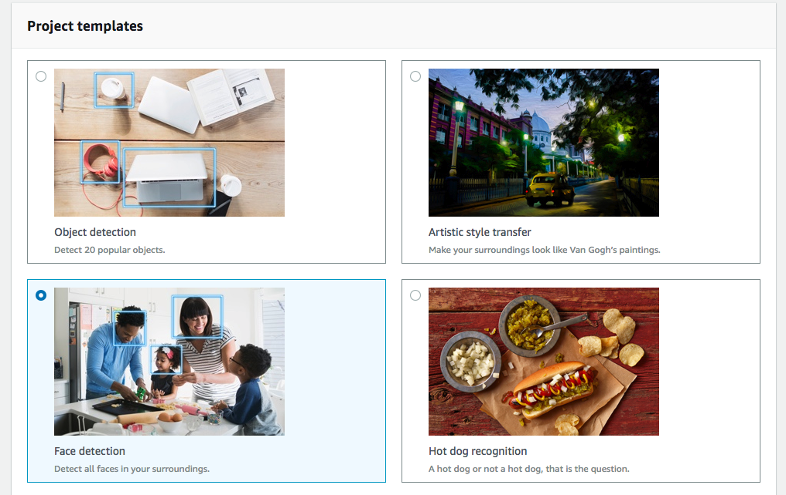
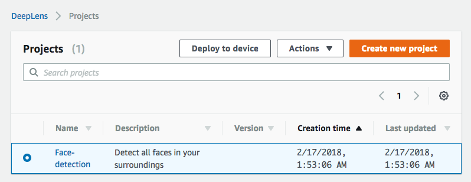
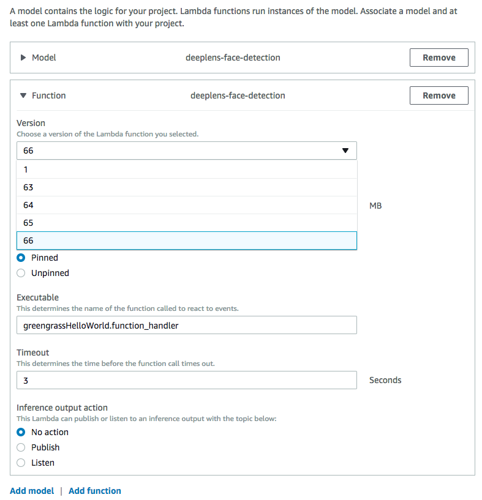
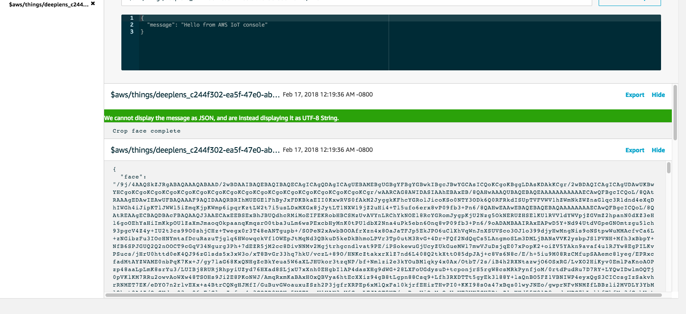
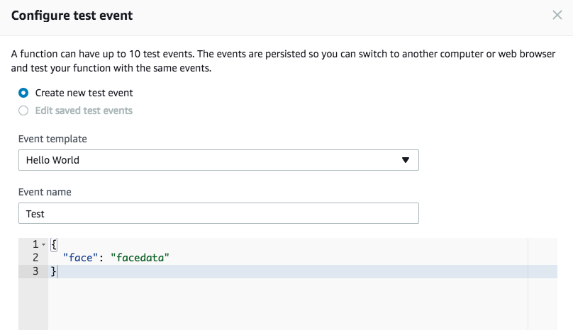
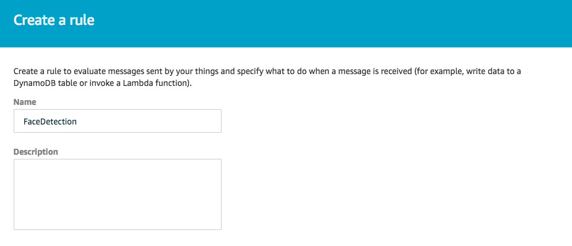
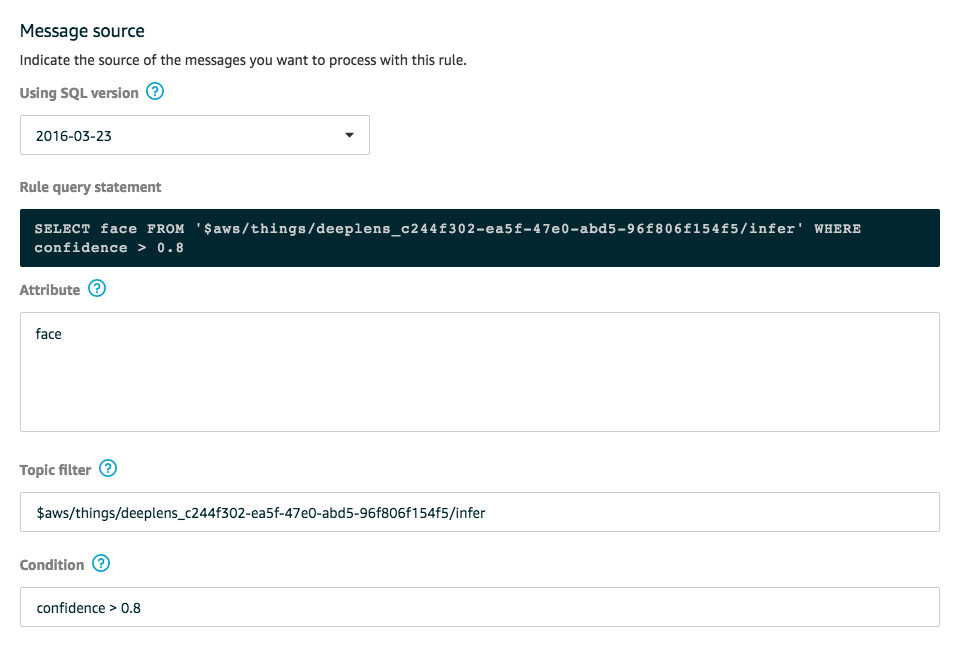
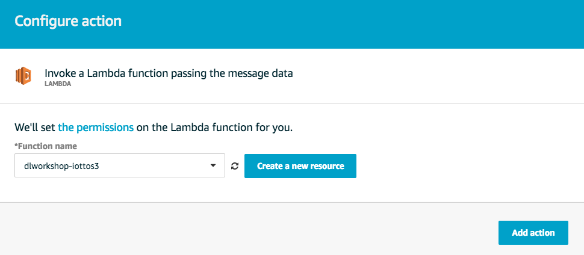
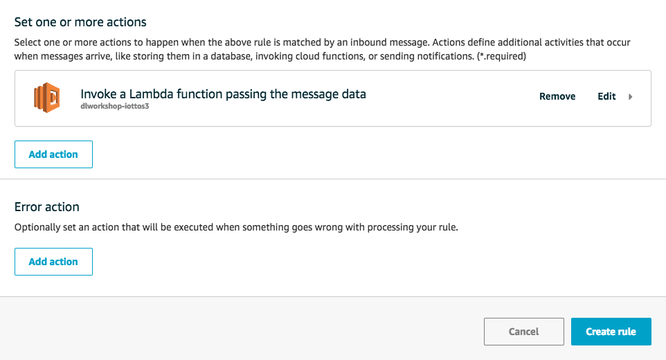

# Lab 1 - Face Detection Using Deep Lens

## Create Your Project

1. Using your browser, open the AWS DeepLens console at https://console.aws.amazon.com/deeplens/.
2. Choose Projects, then choose Create new project.
3. On the Choose project type screen
- Choose Use a project template, then choose Face detection.



- Scroll to the bottom of the screen, then choose Next.
4. On the Specify project details screen
   - In the Project information section:
      - Either accept the default name for the project, or type a name you prefer.
      - Either accept the default description for the project, or type a description you prefer.
   - In the Project content section:
      - Model—make sure the model is deeplens-face-detection. If it isn't, remove the current model then choose Add model. From the list of models, choose deeplens-face-detection.
      - Function—make sure the function is deeplens-face-detection. If it isn't, remove the current function then choose Add function. From the list of functions, choose deeplens-face-detection.

      

  - Choose Create.

This returns you to the Projects screen where the project you just created is listed with your other projects.

## Deploy your project

Next you will deploy the Face Detection project you just created.

1. From Deeplens console, On the Projects screen, choose the radio button to the left of your project name, then choose Deploy to device.



2. On the Target device screen, from the list of AWS DeepLens devices, choose the radio button to the left of the device that you want to deploy this project to. An AWS DeepLens device can have only one project deployed to it at a time.


3. Choose Review.

   This will take you to the Review and deploy screen.

   If a project is already deployed to the device, you will see an error message
   "There is an existing project on this device. Do you want to replace it?
   If you Deploy, AWS DeepLens will remove the current project before deploying the new project."

4. On the Review and deploy screen, review your project and choose Deploy to deploy the project.

   This will take you to to device screen, which shows the progress of your project deployment.

## View your project output

1. You need mplayer to view the project output from Deeplens device. Install mplayer by using command below in the terminal window:

```
brew install mplayer
```

2. Wait until the project is deployed and you see the message Deployment of project Face-detection, version 0 succeeded. After project is successfully deployed, use the command below from terminal window to view project output stream:

```
ssh aws_cam@<IP Address of your deeplens device> cat /tmp/results.mjpeg | mplayer -demuxer lavf -lavfdopts format=mjpeg:probesize=32 -
```
Example:
```
ssh aws_cam@192.168.86.120 cat /tmp/results.mjpeg | mplayer -demuxer lavf -lavfdopts format=mjpeg:probesize=32 -
```

## Crop face and send to cloud

In this section you will update the lambda function that is part of face detection project to crop face and send it as IoT message. You will then create a rul in IoT to save that image to S3 if confidence level is above 50%.

1. Using your browser, open the AWS Lambda console at https://console.aws.amazon.com/lambda/home?region=us-east-1#/functions.
2. In the search box type deeplens-face-detection to find the lambda function for your project and click on the name of your lambda function.
3. Replace code in lambda function with code from [facecrop.py](facecrop.py) and click Save.
4. Click on Action and then Publish a new version.
5. Enter version description and click Publish.
6. Open the AWS DeepLens console at https://console.aws.amazon.com/deeplens/.
7. Choose Projects, then choose click on the project Face-detection.
8. On project details screen, click on Edit.
9. On Edit project screen, under Project content, click on Function to expand that section.

10. Under Version, select the current version that you just published.
11. Click Save. This will take you back to you project screen.

### Deploy updated project

Next you will deploy the Face Detection project you just updated.

1. From Deeplens console, On the Projects screen, choose the radio button to the left of your project name, then choose Deploy to device.

2. On the Target device screen, from the list of AWS DeepLens devices, choose the radio button to the left of the device that you want to deploy this project to. An AWS DeepLens device can have only one project deployed to it at a time.

3. Choose Review.

   This will take you to the Review and deploy screen.

   Since the project is already deployed to the device, you will see an error message
   "There is an existing project on this device. Do you want to replace it?
   If you Deploy, AWS DeepLens will remove the current project before deploying the new project."

4. On the Review and deploy screen, review your project and choose Deploy to deploy the project.

   This will take you to to device screen, which shows the progress of your project deployment. Wait until the project is deployed and you see the message Deployment of project Face-detection, version 1 succeeded. After project is successfully deployed.

### View face detection and cropped face output in IoT

1. Using your browser, open the AWS IoT console at https://console.aws.amazon.com/iot/home?region=us-east-1#/dashboard.
2. Click on Test and enter the subscription topic for your Deeplens device which is in the format "$aws/things/deeplens_c2422202-e22f-4220-a333-9456789154f5/infer"
3. Click on Subscribe to topic. That will take you the screen for topic where you can see all incoming messages.
4. As Deeplens detect a face, it will crop the face and send image as json message to IoT.


## Save Images from IoT messages to S3

In this section you will create resources including S3 bucket, Lambda function and IoT rule to invoke the lambda function with image data if confidence level is above 80%.

### Create S3 Bucket

_This is the bucket to which cropped faces coming from DeepLens will be stored._

1. Go to S3 in AWS Console at https://s3.console.aws.amazon.com/s3/home?region=us-east-1.
2. Click "Create bucket", and enter the following details:
*	Bucket name: _[Your name or username]-dl-faces_
*	Region: US East (N. Virginia)
3.	Click "Create".

### Create an IAM Role

_This will allow our Lambda function (created in later steps) to access our S3 bucket, and other services that will be used in later parts of this workshop._

1. Go to IAM in AWS Console at https://console.aws.amazon.com/iam/home?region=us-east-1#/home
2.	On the left-hand side of the screen, click "Roles", and then click “Create Role”.
3.	Click “AWS service” and click “Lambda”.
4.	Click “Next: Permissions” (at the bottom of the screen).
5.	In the Search field, type _s3_, and then select “AmazonS3FullAccess” (i.e. click the checkbox to the left of “AmazonS3FullAccess”; see screenshot below).
6.	Repeat for other required services as follows:
   - In the Search field, type _step_, and then select “AWSStepFunctionsFullAccess”.
   - In the Search field, type _rek_, and then select “AmazonRekognitionFullAccess”.
   - In the Search field, type _dyn_, and then select “AmazonDynamoDBFullAccess”.
   - In the Search field, type _ses_, and then select “AmazonSESFullAccess”.
   - In the Search field, type _cog_, and then select “AmazonCognitoPowerUser”.
7.	Click “Next: Review” (at the bottom of the screen).
8.	In the “Role name” text box, type DL-Lambda-Role
9.	Click “Create role” (at the bottom of the screen).

### Create Lambda Function
1. Using your browser, open the AWS Lambda console at https://console.aws.amazon.com/lambda/home?region=us-east-1#/.
2. On Create function screen, choose Author from scratch, and complete following:
   - Name: dlworkshop-iottos3.
   - Runtime: Python 3.6.
   - Role: Choose an existing role.
   - Existing role*: Select the IAM role DL-Lambda-Role that you just created.
   - Click Create function.
3. Replace code with code from [iottos3.py](iottos3.py).
4. Update the following line with the name of your S3 bucket _[Your name or username]-dl-faces_ that you created above to store images and click Save.
   ```
   bucket = "YOUR-S3-BUCKET-NAME"
   ```
5. Click on drop down Select a test event... and click Configure test events
   - Leave the defaults as Create new test event and Event template Hello World
   - Event name: Test
   - Replace JSON in the text box with JSON below:
   ```
   { "face": "facedata" }
   ```
   
   - Click Create
6. Click on Test
7. Your lambda function should return URL of file it just created in S3.
8. Go to S3 bucket _[Your name or username]-dl-faces_ and verify that you can see the file lambda function just created.

### Create IoT Rule
1. Using your browser, open the AWS IoT console at https://console.aws.amazon.com/iot/home?region=us-east-1#/dashboard.
2. Click on Act and click Create.
3. On Create a rule screen, complete following:
   - Name: Enter FaceDetection
   
   - Attribute: face
   - Topic filter: Enter the name of IoT topic for your Deeplens device (example: $aws/things/deeplens_c1234562-ea5f-47e0-abd5-96f8123456f5/infer)
   - Condition: confidence > 0.8
   
   - Under Set on or more actions:
      - Click Add action
      - Under Select an action, choose Invoke a Lambda function passing the message.
      
      - Scroll to the bottom of the screen and click Configure action.
      - On Configure action screen, under Function name, select the dlworkshop-iottos3 lambda function.
      
      - Click Add action
      
      - Click Create rule.

### Verify Deeplens is sending faces to S3
Go to S3 bucket _[Your name or username]-dl-faces_ and you should now see images coming from Deeplens.


## Completion
You have successfully created and deployed a face detection project on DeepLens. You also modified the default project so when DeepLens detects a human face, it will crop the face and store as image in S3. In the next [Rekognition](../2-Rekognition), you will learn how Amazon Rekognition provides Deep learning-based image and video analysis capabilities including face verification.
